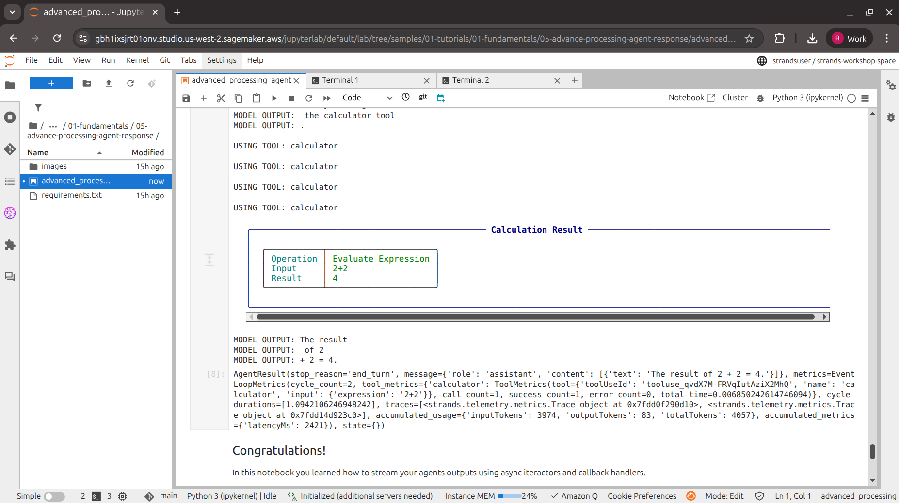

# Building Responsive AI Agents: Advanced Processing of Strands Agent Responses

## Introduction

In the world of AI agents, user experience is paramount. Users expect real-time feedback as agents process their requests, not a blank screen followed by a wall of text. The **Strands Agents SDK** provides powerful mechanisms for streaming agent responses, enabling developers to build highly responsive applications.

In this blog post, we'll explore **Lab 5: Advanced Processing of Agent Response** from the [Strands Agents Samples repository](https://github.com/strands-agents/samples), part of the AI for Bharat Workshop series. This lab demonstrates two essential techniques for handling agent outputs in real-time: **Async Iterators** and **Callback Handlers**.

## Why Streaming Matters

Traditional request-response patterns can leave users waiting without feedback. For AI agents that may take several seconds to:
- Reason through complex problems
- Execute multiple tools
- Generate lengthy responses

...real-time streaming transforms the user experience from frustrating to engaging.

## Lab Overview

This lab focuses on intercepting and processing events as they happen during agent execution. The two methods covered are:

| Method | Best For |
|--------|----------|
| **Async Iterators** | Asynchronous frameworks like FastAPI, aiohttp, Django Channels |
| **Callback Handlers** | Real-time monitoring, custom output formatting, external system integration |

### Architecture

The lab uses a single-agent architecture with:
- **Native tools**: Calculator
- **Custom tools**: Weather Forecast (for FastAPI demo)
- **Model**: Claude 3.7 Sonnet on Amazon Bedrock

## Method 1: Async Iterators for Streaming

The `stream_async` method returns an asynchronous iterator, perfect for modern async Python frameworks.

### Basic Implementation

```python
from strands import Agent
from strands_tools import calculator

# Initialize agent without callback handler for streaming
agent = Agent(
    model="us.anthropic.claude-3-7-sonnet-20250219-v1:0",
    tools=[calculator],
    callback_handler=None
)

async def process_streaming_response():
    agent_stream = agent.stream_async("Calculate 2+2")
    async for event in agent_stream:
        print(event)

# Run the agent
asyncio.run(process_streaming_response())
```

### Tracking Event Loop Lifecycle

For debugging and monitoring, you can track the complete event lifecycle:

```python
async def process_streaming_response():
    agent_stream = agent.stream_async("What is the capital of France and what is 42+7?")
    async for event in agent_stream:
        if event.get("init_event_loop", False):
            print("Event loop initialized")
        elif event.get("start_event_loop", False):
            print("Event loop cycle starting")
        elif "current_tool_use" in event and event["current_tool_use"].get("name"):
            print(f"Using tool: {event['current_tool_use']['name']}")
        elif "data" in event:
            print(f"Text: {event['data'][:50]}...")
```

### FastAPI Integration

One of the most powerful use cases is integrating streaming with web frameworks:

```python
from fastapi import FastAPI
from fastapi.responses import StreamingResponse
from strands import Agent, tool
from strands_tools import calculator

@tool
def weather_forecast(city: str, days: int = 3) -> str:
    return f"Weather forecast for {city} for the next {days} days..."

app = FastAPI()

@app.post("/stream")
async def stream_response(request: PromptRequest):
    async def generate():
        agent = Agent(tools=[calculator, weather_forecast], callback_handler=None)
        async for event in agent.stream_async(request.prompt):
            if "data" in event:
                yield event["data"]

    return StreamingResponse(generate(), media_type="text/plain")
```

## Method 2: Callback Handlers

Callback handlers provide a more direct approach to intercepting events during agent execution.

```python
def custom_callback_handler(**kwargs):
    if "data" in kwargs:
        print(f"MODEL OUTPUT: {kwargs['data']}")
    elif "current_tool_use" in kwargs and kwargs["current_tool_use"].get("name"):
        print(f"\nUSING TOOL: {kwargs['current_tool_use']['name']}")

# Create agent with custom callback handler
agent = Agent(
    model="us.anthropic.claude-3-7-sonnet-20250219-v1:0",
    tools=[calculator],
    callback_handler=custom_callback_handler
)

agent("Calculate 2+2")
```

Callback handlers receive events for:
- Text generation from the model
- Tool selection and execution
- Reasoning process
- Errors and completions

## Lab Output

Here's what the lab looks like in action:



The screenshot demonstrates:
1. The calculator tool being invoked
2. Real-time streaming of the calculation result
3. The complete agent response with metrics (input tokens, output tokens, total time)

## Key Takeaways

1. **Choose the right method**: Use async iterators for web frameworks, callback handlers for monitoring and custom formatting.

2. **Disable default callbacks for streaming**: Set `callback_handler=None` when using `stream_async` to avoid duplicate output.

3. **Event-rich data**: The streaming events contain rich metadata including tool usage, reasoning steps, and performance metrics.

4. **Production-ready patterns**: The FastAPI integration pattern shown here is directly applicable to production deployments.

## Getting Started

To run this lab yourself:

```bash
# Clone the repository
git clone https://github.com/strands-agents/samples.git
cd samples

# Navigate to the lab
cd 01-tutorials/01-fundamentals/05-advance-processing-agent-response

# Install dependencies
pip install -r requirements.txt

# Open the notebook
jupyter notebook advanced_processing_agent_response.ipynb
```

### Prerequisites
- Python 3.10+
- AWS account with Amazon Bedrock access
- Claude 3.7 Sonnet model enabled

## Conclusion

Streaming agent responses is no longer optional for production AI applications. The Strands Agents SDK makes it straightforward to implement responsive, real-time agent interactions whether you're building a FastAPI backend, a monitoring dashboard, or a custom integration.

The patterns demonstrated in Lab 5 provide a solid foundation for building AI agents that feel responsive and engaging to end users.

## Resources

- [Strands Agents Documentation](https://strandsagents.com)
- [Strands Agents Samples Repository](https://github.com/strands-agents/samples)
- [Python SDK](https://github.com/strands-agents/sdk-python)
- [TypeScript SDK](https://github.com/strands-agents/sdk-typescript)

---

*This blog post is part of the AI for Bharat Workshop series, demonstrating practical AI agent development patterns using the Strands Agents SDK on AWS.*
